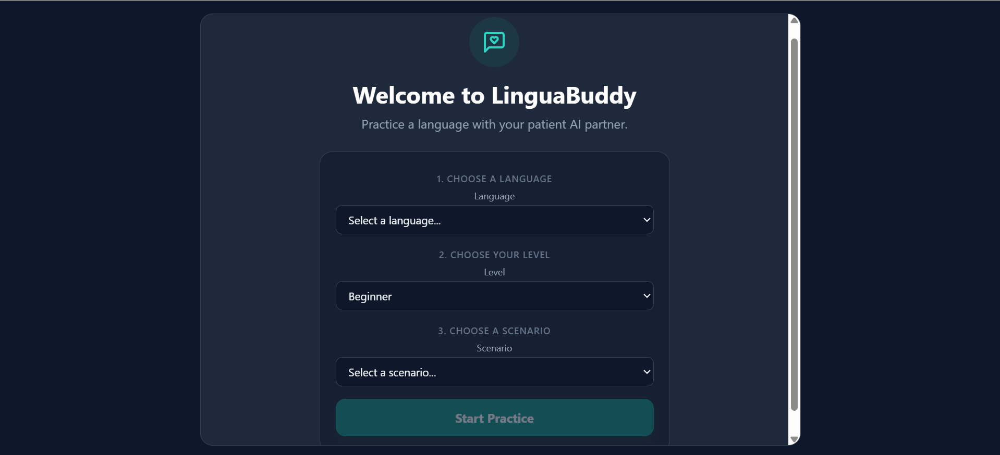
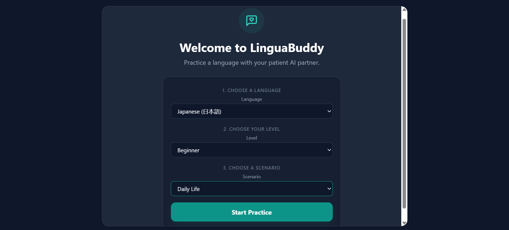
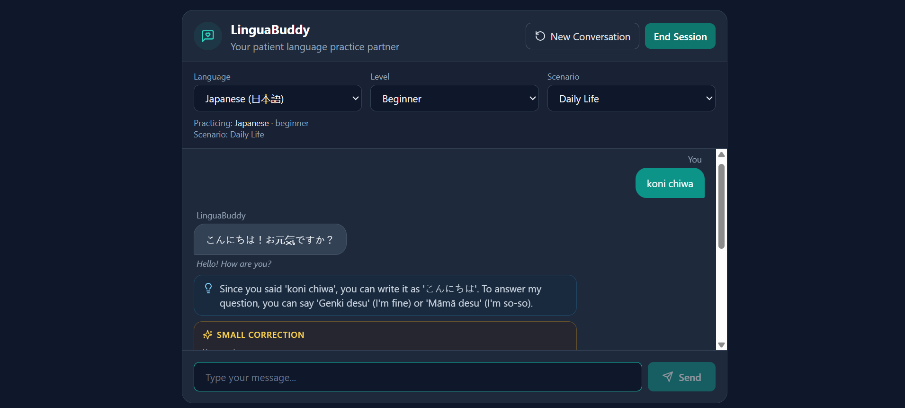
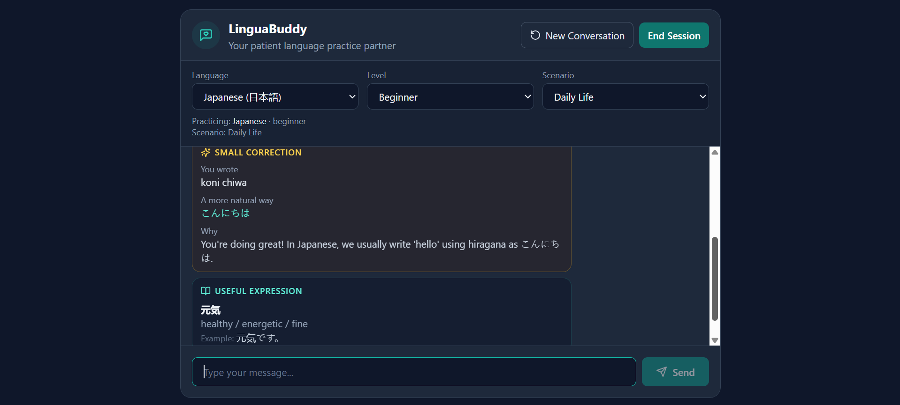
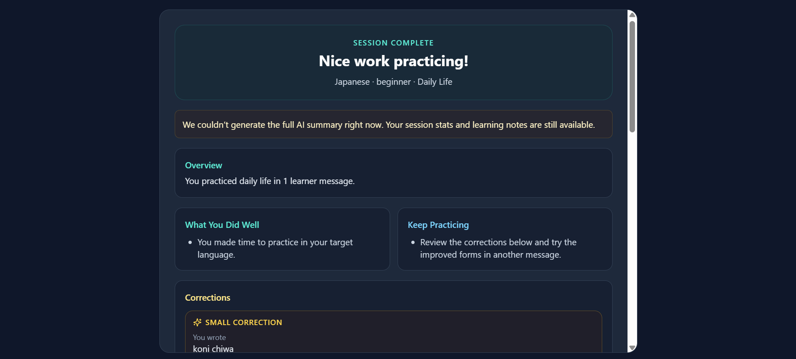
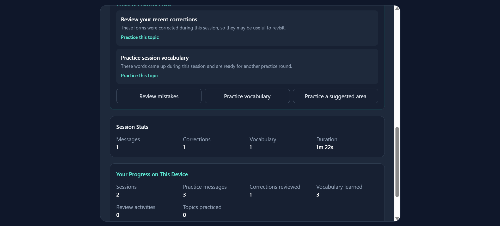

# LinguaBuddy 🗣️💬

A patient AI language-practice partner designed for real conversational practice.

## Overview

LinguaBuddy is an open-source project building a supportive companion for language learners. Rather than treating AI as a generic chatbot, LinguaBuddy is designed to adapt to the learner's target language, proficiency level, and chosen scenario to deliver natural conversation, gentle corrections, and structured explanations.

---

## Current Project Status: Stage 7 — Adaptive Learning & Review

> LinguaBuddy is a **language-agnostic** practice partner. The learner's target language and level are sent to the backend as plain data and passed to Gemma 4, which performs the language-aware conversation, gentle corrections, vocabulary suggestions and level adaptation. There is no per-language grammar code in the app.
>
> Before chatting, the learner chooses a **Language**, **Level**, and **Scenario** in a no-login onboarding screen. After a session, Gemma can suggest up to three evidence-based review topics and generate a short multiple-choice activity on demand. Aggregate counts and topic labels stay in this browser; raw conversations are not persisted.

---

## Tech Stack

### Frontend
- **React** (v18+), **Vite**, **JavaScript**, **Tailwind CSS**, **Lucide React**

### Backend
- **Node.js**, **Express**, **JavaScript**

### AI
- **Model:** Google Gemma 4 (`gemma-4-26b-a4b-it`)
- **SDK:** Official `@google/genai` (server-side only; the API key never reaches the browser)

---

## Feature Roadmap & Status

| Feature                            | Status        | Description                                          |
| ---------------------------------- | ------------- | ---------------------------------------------------- |
| **Project Foundation & Docs**      | ✅ Implemented | Base structure, docs, scripts, build config          |
| **Backend Health Check**           | ✅ Implemented | `GET /api/health` endpoint                           |
| **Gemma 4 AI Service Integration** | ✅ Implemented | Server-side `@google/genai`, `POST /api/chat`        |
| **Interactive Chat Experience**    | ✅ Implemented | Multi-turn chat UI, loading/error states, New Conversation |
| **Gentle Corrections, Vocabulary, Adaptive Level** | ✅ Implemented | Gemma returns optional correction/vocabulary; any target language |
| **Language & Level Selectors**     | ✅ Implemented | Choose the target language and level; sent to Gemma on every request |
| **Scenario Selector & Onboarding** | ✅ Implemented | Choose language, level, and scenario before chat; scenario guides Gemma |
| **Session Summary & Local Progress** | ✅ Implemented | End-of-session learning summary and browser-local aggregate counts |
| **Adaptive Learning & Review** | ✅ Implemented | Evidence-based insights, on-demand targeted activity, immediate answer feedback, browser-local review totals |

---

## Screenshots

### 1. Choose a language, level, and scenario



### 2. Configure a practice session



### 3. Practice in a conversation



### 4. Review corrections and vocabulary



### 5. See your session summary



### 6. Choose an adaptive review activity



---

## Multilingual Design

- **Supported by architecture:** any target language Gemma can handle (for example English, Japanese, Korean, Spanish, French, German, Hindi, Bengali, Italian, Portuguese, Mandarin Chinese). The language is data (`targetLanguage`), not application logic.
- **Verification:** unit tests cover Unicode language handling and safe summary fallbacks. Live Gemma replies require the Google API to be reachable; see `docs/AI_DESIGN.md`.
- **Choosing practice settings:** select language, level, and scenario before starting. No language is assumed and no account is required. Changing any setting during practice clears the conversation.
- **Adding a language:** add one line to `client/src/config/languages.js`.

## Session Data & Privacy

The active conversation, corrections, vocabulary, and session metrics stay temporarily in app memory. The browser stores aggregate counts and up to 20 short review topic labels in localStorage. LinguaBuddy does not save raw conversations or send progress to analytics services. Clearing this browser's site data removes local progress.

---

## Project Structure

```
linguabuddy/
├── client/              # React + Vite frontend
│   └── src/
│       ├── components/  # chat, learning feedback and language/level/scenario selectors
│       ├── pages/       # onboarding before practice
│       ├── config/      # languages.js (languages, levels and scenarios)
│       ├── services/    # chatApi.js (calls /api/chat)
│       ├── App.jsx      # conversation state
│       ├── main.jsx
│       └── index.css
│
├── server/              # Node.js + Express backend
│   └── src/
│       ├── services/    # gemmaService.js (Gemma 4 integration)
│       ├── routes/      # chat.js (POST /api/chat)
│       ├── prompts/     # languagePartner.js (system instruction)
│       ├── utils/       # conversation.js, learnerContext.js, gemmaResponse.js + tests
│       └── index.js     # Express server entrypoint
│
├── docs/                # PRD, ARCHITECTURE, WORKFLOW, AI_DESIGN, API
├── README.md
├── LICENSE
├── .gitignore
└── package.json
```

---

## Local Development Setup

### Prerequisites
- **Node.js** (v18.0 or higher), **npm** (v9.0 or higher)
- A Google Gemini API key (free from Google AI Studio)

### Installation

1. Clone the repository:

```
git clone https://github.com/kaushanikoner20-hub/linguabuddy.git
cd linguabuddy
```

2. Install root, client and server dependencies:

```
npm run setup
```

3. Set up environment configuration and add your own key to `server/.env` (this file is git-ignored; never commit it):

```
cp server/.env.example server/.env
```

4. Start the client and server together:

```
npm run dev
```

  - Client: `http://localhost:5173`
  - Server: `http://localhost:5000`

5. Verify the health check:

```
curl http://localhost:5000/api/health
```

6. Run the backend and session unit tests:

```
npm run test:server
npm run test:session
```


---

## License

This project is open-source under the [MIT License](LICENSE).
